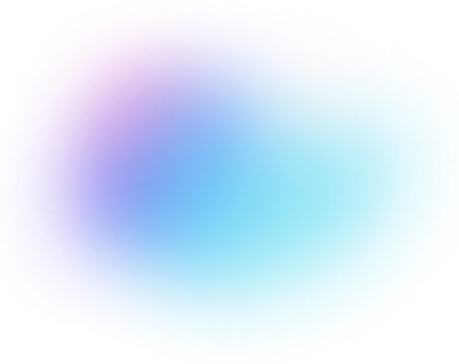

# Design System — Betty Chen Portfolio

> Single source of truth for colors, typography, spacing, layout, and components.
> Every new page and component should be built from the tokens and patterns defined here.

---

## Design Principles

1. **Content is the hero.** Visuals support the story, never compete with it.
2. **Systematic, not ad-hoc.** Use defined tokens. Do not introduce one-off values.
3. **Responsive by default.** Every component must degrade gracefully across all four breakpoints.
4. **Minimal markup, maximum clarity.** HTML structure should reflect the content hierarchy, not the visual layout.

---

## File Structure

| File | Scope |
|------|-------|
| `style.css` | Global: nav, homepage hero, project cards, side projects, footer |
| `page-style.css` | Case study pages: hero, block-a, block-b, impact snapshot, project summary, video components |

All pages load `style.css`. Case study pages and About additionally load `page-style.css`.

---

## Color Tokens

### Neutrals

| Token name | Value | Usage |
|---|---|---|
| `color-bg-base` | `#FFFFFF` | Page background, card backgrounds |
| `color-bg-subtle` | `#F7F7F9` | Full-image block container backgrounds |
| `color-bg-surface` | `#F8F8F8` | Footer background |
| `color-bg-project-card` | `#EBEEF5` | Project card image pseudo-background |
| `color-border-light` | `#F0F0F0` | Header bottom border |
| `color-border-strong` | `#000000` | Project summary top/bottom dividers |
| `color-text-primary` | `#000000` | Headings, strong labels |
| `color-text-body` | `#333333` | Body text, card text, list items |
| `color-text-secondary` | `#555555` | Supporting descriptions |
| `color-text-tertiary` | `#808080` | Section labels, muted headings, tags |
| `color-text-muted` | `#AAAAAA` | Project tags, hero H1, decorative text |

> **Rule:** Use these five text levels in order. Do not introduce other gray values.

### Project Accent Colors

Each case study project has one accent color, applied to impact metric numbers and circle area highlights.

| Project | Accent | Token name |
|---|---|---|
| Rezio | `#005ABE` | `color-accent-rezio` |
| GoFace (Astra) | `#FF8901` | `color-accent-goface` |
| D-Link | `#4998a9` | `color-accent-dlink` |
| mydlink | `#4AD4FF` | `color-accent-mydlink` |
| Lucky Draw | `#FF3E68` / `#FFD8E1` | `color-accent-luckydraw` / `color-accent-luckydraw-bg` |

### Semantic Colors

| Usage | Value | Class |
|---|---|---|
| Rejected / wrong design option (✕) | `#C0392B` | `.design-x` |
| Selected / correct design option (✓) | `#27AE60` | `.design-o` |

---

## Typography

**Font family:** `'Inter', -apple-system, BlinkMacSystemFont, 'Segoe UI', Roboto, sans-serif`
**Base size:** `16px` — **Base line-height:** `1.6`

| Token name | Size | Weight | Line height | Transform | Use case |
|---|---|---|---|---|---|
| `text-display` | `48px` (3rem) | 700 | 1.2 | — | Page title, homepage H1 |
| `text-h2` | `2.5rem` | 400 | 3rem | — | Block A / B narrative section titles |
| `text-h3` | `1.4rem` | 600 | — | — | Featured project card names |
| `text-h4` | `1.2rem` | 600 | 1.3 | — | Impact card titles |
| `text-subheading` | `1.25rem` | 600 | — | — | `.image-caption-title` (no uppercase) |
| `text-subheading-label` | `1.25rem` | 600 | — | uppercase + 1px spacing | `.section-title`, `.summary-title`, `.footer-section h4` |
| `text-body-lg` | `1.1rem` | 400 | 1.7 | — | Hero descriptions, image card quote text |
| `text-body` | `1rem` | 400 | 1.6–1.7 | — | Standard body copy |
| `text-body-sm` | `0.95rem` | 400 | 1.5 | — | Tags, list items, link labels |
| `text-body-xs` | `0.9rem` | 400 | 1.5–1.6 | — | Small card text |
| `text-caption` | `0.85rem` | 400 | — | — | Copyright, small metadata |

> **`text-subheading` / `text-subheading-label`:** These three classes share `1.25rem / 600 / #808080`. The difference is uppercase + letter-spacing: `.image-caption-title` is mixed case; `.section-title` and `.summary-title` are uppercase.

### Responsive type scale

| Breakpoint | `text-display` | `text-h2` |
|---|---|---|
| Desktop (> 1024px) | 48px | 2.5rem |
| Tablet (≤ 1024px) | 40px | — |
| Mobile (≤ 768px) | 32px | 2rem |
| Small (≤ 480px) | 28px | 1.8rem |

---

## Spacing Scale

All spacing values are multiples of 8px.

| Token | Value | Common usage |
|---|---|---|
| `space-1` | `8px` | List item gaps, inline micro-spacing |
| `space-2` | `16px` | Compact internal padding |
| `space-3` | `20px` | Grid gaps (side cards, impact cards) |
| `space-4` | `24px` | Component padding (image card, paragraphs) |
| `space-5` | `32px` | Image card desktop padding |
| `space-6` | `40px` | Standard section content padding, grid gaps |
| `space-7` | `60px` | Medium section separation |
| `space-8` | `80px` | Major section vertical rhythm (block-a, block-b margins) |
| `space-9` | `100px` | Footer top margin |

---

## Layout & Grid

- **Max content width:** `1200px`, centered with `margin: 0 auto`
- **Page horizontal padding:** `40px` (desktop) → `30px` (≤ 1024px) → `20px` (≤ 768px)
- **Fixed header height:** `80px` — `main-content` has matching `margin-top`

### Named grid patterns

| Name | Columns | Gap | Where used |
|---|---|---|---|
| `layout-hero-home` | `1fr 1fr` | `40px` | Homepage hero text + decoration |
| `layout-project-feature` | `1.2fr 1fr` | `60px` | Featured project card |
| `layout-side-projects` | `repeat(3, 1fr)` | `20px` | Homepage side project cards |
| `layout-hero-page` | `1.4fr 1fr` | `40px` | Case study hero (image + quote card) |
| `layout-block-a` | `3fr 9fr` | `40px` | Sidebar title + wide content |
| `layout-summary-4col` | `repeat(4, 1fr)` | `40px` | Project summary, 4 columns |
| `layout-summary-3col` | `1fr 1fr 1fr` | `40px` | Project summary, 3 columns |
| `layout-impact` | `repeat(3, 1fr)` | `20px` | Impact snapshot cards |
| `layout-footer` | `1fr 1fr` | `40px` | Footer left + right |
| `layout-caption-2` | `repeat(2, 1fr)` | `40px` | Block B `.col-2` |
| `layout-caption-3` | `repeat(3, 1fr)` | `40px` | Block B `.col-3` |
| `layout-caption-4` | `repeat(4, 1fr)` | `40px` | Block B `.col-4` |

---

## Breakpoints

| Name | Value | Behavior |
|---|---|---|
| `bp-desktop` | > 1024px | Full layout, all multi-column grids active |
| `bp-tablet` | ≤ 1024px | Reduced gaps, slightly smaller type |
| `bp-mobile` | ≤ 768px | Most grids collapse to single column |
| `bp-small` | ≤ 480px | Further type reduction, tighter padding |
| `bp-col4` | ≤ 720px | 4-col → 3-col (caption grids only) |
| `bp-col3` | ≤ 680px | 3-col → 2-col (caption grids only) |

---

## Components

### Navigation (`.header`)

Fixed bar, full width, `z-index: 1000`.

```html
<header class="header">
  <div class="nav-container">
    <a class="logo" href="index.html"></a>
    <nav class="nav-links">
      <a href="index.html" class="active">Work</a>
      <a href="about.html">About</a>
      <a href="...">Resume</a>
    </nav>
  </div>
</header>
```

- Active page: add `class="active"` to the matching link.
- Inactive links: `color-text-muted` (`#AAAAAA`). Active: `#000000`. Hover: `#666666`.

---

### Hero — Homepage

Contains a floating decorative image and the "Hej!" text block.

```html
<section class="hero">
  
  <div class="hero-content-wrapper">
    <div class="hero-text-content">
      <h1>Hello, I'm Betty Chen.</h1>
      <div class="subtitle">Product Designer</div>
      <p class="description">…</p>
    </div>
    <div class="hero-hej">Hej!</div>
  </div>
</section>
```

---

### Hero — Case Study Page

Background image set via a theme modifier class on `.hero-content`.

```html
<section class="hero">
  <h1 class="page-title">Project Title</h1>
  <div class="project-tags">
    <span class="project-tag">Tag</span>
  </div>
  <div class="hero-content hero-content-{project}">
    <div class="hero-image-wrapper">
      
    </div>
    <div class="image-card">
      
      <p>One-sentence project summary.</p>
      <div class="image-subtitle-wrapper">• Key stat 1<br>• Key stat 2</div>
    </div>
  </div>
</section>
```

**Available hero background classes:**

| Class | Project |
|---|---|
| `.hero-content-rezio` | Rezio – Flexible Booking Dates |
| `.hero-content-rezio2` | Rezio – Order List |
| `.hero-content-goface` | Astra GoFace |
| `.hero-content-mydlink` | mydlink Home App |
| `.hero-content-dlink` | D-Link Router Web GUI |

---

### Project Summary (`.project-summary`)

Top and bottom borders in `color-border-strong`. Use 3-col or 4-col layout.

```html
<section class="project-summary">
  <div class="summary-grid-3col">   <!-- or summary-grid for 4 col -->
    <div class="summary-column">
      <h4 class="summary-title">TIMELINE</h4>
      <ul class="summary-list">
        <li>2025/4 – 2025/6</li>
      </ul>
    </div>
    <!-- repeat for MY ROLE, IMPACT -->
  </div>
</section>
```

- `.summary-title` uses `text-label` style (0.85rem, uppercase, `color-text-tertiary`).
- `.im-here` class on a `<li>` renders in `color-text-muted` — marks current position in a career timeline.

---

### Block A (`.block-a`)

Two-column sidebar layout: `3fr` title/image left, `9fr` content right.

```html
<div class="block-a">
  <div class="block-a-left">
    <h2 class="block-a-title">Section Title</h2>
  </div>
  <div class="block-a-content">
    <p>Body copy.</p>
    <!-- optional: <div class="full-image"></div> -->
  </div>
</div>
```

- `.full-image` inside block-a spans both columns (`grid-column: 1 / -1`), rounded corners, `#F7F7F9` background.
- Supports `<video>` elements — they inherit full-width display automatically.

---

### Block B (`.block-b`)

Full-width section, usually containing image + caption grids.

```html
<div class="block-b">
  <h2 class="block-b-title">Section Title</h2>
  <div class="block-b-content">
    <div class="image-caption-block">
      <h3 class="image-caption-title">Group Label</h3>
      <div class="image-caption-container col-3">  <!-- col-2, col-3, col-4 -->
        <div class="image-caption-item">
          
          <p>Caption text.</p>
        </div>
        <!-- repeat -->
      </div>
    </div>
  </div>
</div>
```

**Special item variants:**
- `.goface-icon-item` — centers content; use with `.goface-icon` image class (180×180px).
- `.feedback-text-box` — white card with shadow; wraps user feedback quotes.
- `.full-image` — padded container with `#F7F7F9` bg for wide showcase images.

**Design validation labels** (use inside `.block-b`):

```html
<p class="design-o">Selected option — renders ✓ in green</p>
<p class="design-x">Rejected option — renders ✕ in red</p>
```

---

### Circle Area (`.circle-area`)

Centered, circular label used to visualize user insights or goals.

```html
<div class="circle-area">
  <div class="circle"><p>Short insight text</p></div>
</div>
```

- Default color: `color-accent-mydlink` (`#4AD4FF`).
- Lucky Draw override: wrap the parent in `.luckydraw-refine-goals` — circle becomes pink/red.
- Size: 180×180px desktop, 160px tablet, 140px mobile.

---

### Featured Project Card (`.project-link` + `.project`)

Homepage main project cards with hover zoom on image.

```html
<a class="project-link" href="page.html">
  <div class="project">
    <div class="project-text">
      
      <h3>Project Name</h3>
      <p>Short description.</p>
      <div class="project-tags">
        <span class="project-tag">Tag A</span>
        <span class="project-tag">Tag B</span>
      </div>
    </div>
    <div class="project-image">
      
    </div>
  </div>
</a>
```

---

### Side Project Card (`.side-card`)

Homepage 3-column grid. Image is always 200px tall.

```html
<a href="page.html">
  <div class="side-card">
    <div class="side-card-image-wrapper">
      
      <!-- coming soon: add .coming-soon-overlay inside -->
    </div>
    <div class="side-card-content">
      <h4>Project Name</h4>
      <p>Short description.</p>
      <span class="tag">Tag</span>
    </div>
  </div>
</a>
```

For a coming-soon state, add `.coming-soon` to `.side-card` and insert inside the image wrapper:
```html
<div class="coming-soon-overlay"><span class="coming-soon-text">COMING SOON</span></div>
```

---

### Video Components

**Native video with play button overlay:**
```html
<a class="video-link" href="video.mp4" target="_blank">
  <div class="video-thumbnail">
    
    <div class="video-play-button"><div class="icon-play-circle"></div></div>
  </div>
</a>
```

**YouTube embed (full width, 16:9):**
```html
<div class="youtube-video-wrapper">
  <iframe src="https://www.youtube.com/embed/…" frameborder="0" allowfullscreen></iframe>
</div>
```

**Two YouTube videos side by side:**
```html
<div class="youtube-video-wrapper-smail">
  <div class="youtube-video-item"><iframe …></iframe></div>
  <div class="youtube-video-item"><iframe …></iframe></div>
</div>
```

---

### Share URL Links (`.share_url`)

```html
<div class="share_url">
  <a href="…" target="_blank">Link label</a>
</div>
```

Renders with an animated `→` arrow on hover.

---

### Footer

```html
<footer class="footer">
  <div class="footer-content">
    <div class="footer-left">
      <h3>thanks for stopping by, let's chat!</h3>
      <p>I'd love to meet you :)</p>
      <div class="copyright">© 2025 Betty Chen</div>
    </div>
    <div class="footer-right">
      <div class="footer-section">
        <h4>Contact Me</h4>
        <ul><li><a href="…">Email</a></li></ul>
      </div>
      <div class="footer-section">
        <h4>Navigate</h4>
        <ul><li><a href="index.html">Work</a></li></ul>
      </div>
    </div>
  </div>
</footer>
```

---

## Project Theming Summary

When building a new case study page, apply the following per-project values:

| Project | Hero class | Accent color |
|---|---|---|
| Rezio (Flexible Dates) | `.hero-content-rezio` | `#005ABE` |
| Rezio (Order List) | `.hero-content-rezio2` | `#005ABE` |
| Astra GoFace | `.hero-content-goface` | `#FF8901` |
| mydlink Home App | `.hero-content-mydlink` | `#4AD4FF` |
| D-Link Router GUI | `.hero-content-dlink` | `#4998a9` |

---

## Ambient Visual System (homepage only)

Implemented in `ambient.css` + `ambient.js`. Only active when `<body class="page-home">` is present (index.html only). Other pages are unaffected.

### Layers

| Element | Position | z-index | Role |
|---|---|---|---|
| `.site-ambient-bg` | `fixed` | `-2` | Soft gradient blobs behind all content |
| `.cursor-light` | `fixed` | `-1` | Mouse-follow radial glow (desktop only) |
| `header`, `main`, `footer` | normal flow | auto | Content above ambient |

### Blobs

Three blobs (`ambient-blob-1/2/3`): top-right blue, top-left teal, center lavender. All `filter: blur(90px)`, drift on CSS keyframes (22–34s), fade in on load. The `.ambient-fade` div inside `site-ambient-bg` fades them to white at the viewport bottom, preventing bleed into the works section.

### Scroll effects (ambient.js)

- **Hero text fade**: `.hero-text-content` fades + rises as user scrolls past 15%–55% of hero height. rAF-throttled.
- **Card reveal**: `.reveal-item` class triggers `is-visible` via Intersection Observer. Add to any element to opt in. Stagger delays set in CSS via `nth-child`.
- **Cursor light**: 7% eased follow, desktop fine-pointer only, hidden on mobile.
- **Floating image**: existing bounce animation, moved from inline script to `ambient.js`.

### How to add scroll-reveal to new cards
Add `class="reveal-item"` to the element. If it's inside `.featured-projects` or `.side-grid`, stagger is automatic. For other containers, add `nth-child` delay rules in `ambient.css`.

### Reduced motion / mobile
- `prefers-reduced-motion`: blobs appear instantly (no drift), reveal items shown immediately, cursor light hidden.
- Mobile (≤ 768px): blob 3 hidden, blur reduced, cursor light hidden.

---

## Adding a New Case Study Page

1. Copy the HTML structure from an existing case study (e.g., `rezio_flexible_booking_date.html`).
2. Update `<title>` and all text content.
3. Set the correct hero background class from the table above.
4. Add the matching impact theme class if using an Impact Snapshot section.
5. If the project is new (no existing hero bg), add a `background-image` entry in `page-style.css` under the hero background block.
6. Do not introduce new spacing values, colors, or font sizes — use tokens from this document.
